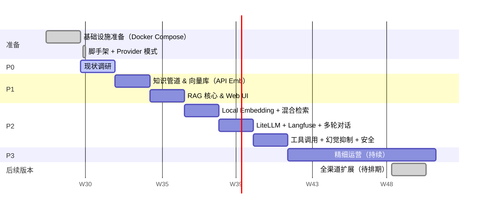
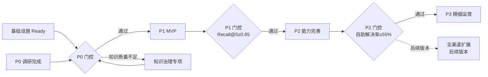

# 企业级 RAG 智能客服系统 — 执行方案规划

| 项目 | 内容 |
| --- | --- |
| 文档名称 | 执行方案规划 |
| 版本 | V1.1 |
| 变更说明 | V1.0 → V1.1：引入 Provider 模式（arch.md §3.3），P1 改用 API Embedding 先行验证，无需 GPU；GPU/本地模型/LiteLLM/Langfuse 整体后移至 P2；基础设施准备由 K8s 降级为 Docker Compose 单机 |
| 关联文档 | design.md V1.1 / arch.md V1.1 |
| 总周期 | 12 周（P0–P2）+ 持续运营（P3）；全渠道扩展列为后续版本规划 |
| 读者对象 | 项目经理、技术负责人、业务负责人 |

---

## 1. 总体时间线

```
第 -2 ~ 0 周   基础设施准备（与 P0 并行）
第  1 ~  2 周   P0  现状调研
第  3 ~  6 周   P1  MVP
第  7 ~ 12 周   P2  能力完善
第 13 周起      P3  精细运营（持续）
────────────────────────────────────────
后续版本        P4  全渠道扩展（微信 / App / 语音，待排期）
```



---

## 2. 团队组成与职责

| 角色 | 人数 | 主要职责 |
| --- | --- | --- |
| 项目经理（PM） | 1 | 计划跟踪、跨团队协调、里程碑门控 |
| 算法工程师 | 2~3 | RAG 管道、Embedding/Rerank 服务、Query 改写、NLI 校验 |
| 后端工程师 | 2~3 | 编排服务、知识管理平台、API 网关、工具调用集成 |
| 前端工程师 | 1 | Web 客服 UI、知识运营后台 |
| DevOps / SRE | 1 | K8s 集群、GPU 节点池、CI/CD、可观测平台 |
| 知识运营 | 1~2 | 文档治理、金标数据集标注、知识体检 |
| 业务分析师 | 1 | 工单问题分类、需求拆解、验收配合 |
| 安全工程师 | 0.5 | 安全审计、红队对抗集构建、合规检查 |

> **关键原则**：算法工程师与后端工程师从 P1 起共同 Owner 同一个服务边界，避免"RAG 逻辑在算法侧、API 在后端侧"导致的接口割裂。

---

## 3. 技术栈选型细节

本节为各技术组件的选型决策依据、推荐方案与关键约束，供 P0 技术选型确认（§5.4）和基础设施准备（§4）直接引用。

> **选型原则**：P1 MVP 阶段优先选运维成本低、集成快速的方案；P2/P3 再按实际规模和性能压力做替换。每次替换须走蓝绿策略 + 金标回归。

---

### 3.1 大模型（LLM）

| 维度 | 内容 |
| --- | --- |
| **推荐（商用 API）** | Claude Sonnet（`claude-sonnet-4-6`）作为主力；备用 GPT-4o |
| **推荐（私有化）** | Qwen2.5-72B-Instruct（全量）或 Qwen2.5-14B-Instruct（INT4 量化，2×A100 可跑） |
| **小模型（辅助）** | Qwen2.5-7B-Instruct INT4 量化，用于滚动摘要生成、意图分类、NLI 校验；单卡 T4 可支撑 |
| **引入阶段** | P1 起用商用 API；后续版本视数据合规要求决定是否切换私有化 |
| **选型依据** | 商用 API 上手快、无需 GPU 资源；私有化适用于数据出境敏感行业；小模型分流降成本 |
| **关键约束** | 主力与评判（LLM-as-Judge）须用不同模型；商用 API 须配 LLM 网关做故障切换，避免单点 |

---

### 3.2 Embedding 模型

| 候选 | 维度 | 特点 | 引入阶段 |
| --- | --- | --- | --- |
| **text-embedding-3-small**（P1 推荐） | 1536 | OpenAI API，无需 GPU，即插即用，`EMBEDDING_PROVIDER=api` | **P1** |
| **BGE-M3**（P2 推荐） | 1024 | 密集 + 稀疏双输出，替代 BM25，多语言；`EMBEDDING_PROVIDER=local` | **P2** |
| BCE-Embedding-Base-V1 | 768 | 中文优化，轻量 | 纯中文备选 |
| Jina-embeddings-v3 | 1024 | 支持 task-specific 微调 | 混合语言备选 |

**P1 推荐**：`text-embedding-3-small`（API 模式），理由：零 GPU 依赖，立即可用，验证 RAG 业务可行性；P0 门控在 API 模式下通过 Recall@5 ≥ 0.80 即可放行 P1。

**P2 切换**：当月 API 费用 > ¥500 或需要稀疏检索时，切换 `EMBEDDING_PROVIDER=local`，走蓝绿索引重建后切流量。

**关键约束**：
- Embedding 模型版本与向量库索引强绑定，切换必须全量重建索引（蓝绿策略，旧索引保留 48h）
- P0 在 API 模式下完成 benchmark；P2 切本地时再做 BGE-M3 vs API 的 Recall@5 对比

---

### 3.3 Rerank 模型

| 候选 | 特点 | 适用场景 |
| --- | --- | --- |
| **BGE-Reranker-v2-m3**（推荐） | BAAI 出品，多语言，单卡 L4 支撑数百 QPS，sigmoid 输出 | 私有化首选 |
| BCE-Reranker-Base-V1 | 中文优化，轻量 | 纯中文 + 资源受限 |
| Jina-Reranker-v2-base-multilingual | 多语言，Apache 2.0 | 多语言备选 |
| Cohere Rerank API | 商用，无需 GPU | GPU 资源不足时过渡方案 |

**P1 默认**：`RERANK_PROVIDER=none`，跳过精排，直接使用 RRF 顺序 Top-6 进入生成。P1 门控不考核 Rerank 延迟，仅要求 Recall@5 ≥ 0.85。

**P2 引入**：BGE-Reranker-v2-m3 私有化部署（与 BGE-M3 Local 模式同批次配置 GPU 环境），切换后必须重新标定阈值。

**关键约束**：
- 相关性阈值（design.md 附录 B 的 0.35）为参考值，**必须在 P2 阶段对选定模型实测标定**（负样本集，FPR < 5%）
- 切换到 `RERANK_PROVIDER=local` 后需在金标数据集上验证 Faithfulness 提升，确认阈值合理后写入 `.env`

---

### 3.4 向量库

| 候选 | 推荐规模 | 特点 |
| --- | --- | --- |
| **PGVector**（P1 推荐） | < 100 万 chunk | PostgreSQL 扩展，运维成本最低，现有 PG 可直接复用 |
| **Qdrant**（P2 后期推荐） | 100 万 ~ 1000 万 chunk | Rust 实现，原生支持稀疏 + 密集混合索引，性能优秀 |
| Milvus | > 500 万 chunk | 分布式，运维较复杂，大规模首选 |
| Elasticsearch 8+ | 已有 ES 集群时复用 | 支持 dense_vector，兼做 BM25，统一运维 |

**推荐策略**：

```
P1 MVP → PGVector（100 万 chunk 内，运维零负担）
P2 后期 → 超过 50 万 chunk 时提前评估迁移 Qdrant
        （Qdrant 原生支持 BGE-M3 的稀疏向量，可取代独立 BM25 服务）
```

**关键约束**：
- ACL / region / effective_to 过滤必须在**向量库 where 条件**中执行，PGVector 和 Qdrant 均原生支持元数据过滤
- HNSW 参数：M=16，efConstruction=200；PGVector 对应 `lists`（IVFFlat）或直接用 HNSW 扩展

---

### 3.5 BM25 / 稀疏检索

| 方案 | 特点 | 推荐场景 |
| --- | --- | --- |
| **BGE-M3 稀疏向量**（推荐） | 已选 BGE-M3 则零额外部署，Qdrant 原生存储 | 与 Qdrant 配合，一库双路 |
| Elasticsearch BM25 | 标准中文分词（IK Analyzer），成熟稳定 | 已有 ES 集群 / 大规模 |
| Tantivy（tantivy-py） | Rust 实现，轻量，无需独立服务 | 无 ES、规模小 |
| Jieba + rank_bm25 | 纯 Python，适合原型验证 | P1 快速验证，不上生产 |

**推荐**：选 BGE-M3 + Qdrant 时，直接使用 BGE-M3 的稀疏输出，无需额外维护 BM25 服务；选 PGVector 时，用独立 Elasticsearch 做 BM25（或 Tantivy 轻量替代）。

---

### 3.6 编排框架

| 候选 | 定位 | 适用场景 |
| --- | --- | --- |
| **LangGraph**（推荐） | 有向图状态机，支持循环、条件分支、持久化状态 | RAG 编排主体，工具调用，转人工流程 |
| LlamaIndex | 知识管道封装完善，RAG 流程开箱即用 | 文档解析、切分、向量化管道 |
| Dify | 开源低代码平台，可视化编排 | 非技术团队快速原型，不适合深度定制 |
| 自研 | 完全可控 | 有大量定制逻辑且团队有积累时 |

**推荐组合**：
- **编排核心** → LangGraph（灵活，调试友好，支持流式输出）
- **知识管道**（解析/切分/向量化）→ LlamaIndex（封装完善）
- 两者通过标准接口（`List[Document]`）对接，各自独立升级

**关键约束**：LangGraph 的 `StateGraph` 状态需持久化到 Redis（会话级），避免服务重启丢失多轮上下文。

---

### 3.7 文档解析

#### PDF 解析

| 场景 | 推荐工具 | 说明 |
| --- | --- | --- |
| 文字型 PDF（可复制） | **Marker**（推荐） + PyMuPDF 兜底 | Marker 保留版面结构，标题层级还原准确 |
| 扫描型 PDF（图片） | **PaddleOCR**（中文）/ Tesseract | PaddleOCR 中文识别精度更高；置信度 < 0.7 标记人工审核 |
| 复杂排版（多栏、表格密集） | Adobe PDF Extract API（商用） | 精度最高，按量付费，用于高价值文档 |

#### 其他格式

| 格式 | 工具 |
| --- | --- |
| Word (.docx) | python-docx |
| Excel / CSV | openpyxl / pandas |
| Markdown | markdown-it-py（保留 AST 以提取标题树） |
| Confluence | Confluence REST API（增量拉取，支持 Webhook） |
| HTML（官网公告） | BeautifulSoup + Readability |

**表格处理**：用 camelot-py（PDF 表格抽取）或 LlamaIndex 的 `TableReader` 转为 Markdown，上方自动补写一句"表格摘要"（由小模型生成）。

---

### 3.8 NLI 校验模型（生成后异步）

| 候选 | 特点 |
| --- | --- |
| **chinese-roberta-wwm-ext-nli**（推荐） | 哈工大预训练，CPU 可跑，延迟 < 50ms，够用 |
| DeBERTa-v3-base-mnli | 多语言 NLI，更准，需 CPU 量化 |
| 主 LLM few-shot NLI | 无需额外模型，但有额外 Token 成本，不推荐实时路径 |

**用法**：以 `(premise=chunk内容, hypothesis=答案中的论断)` 输入，取 `entailment` 概率；低于 0.6 时标记为"待复核"，触发人工复核工单，**不阻断已输出的流式答案**。

---

### 3.9 意图分类 & 内容安全

#### 意图分类

| 候选 | P95 延迟 | 推荐场景 |
| --- | --- | --- |
| **FastText**（推荐） | < 5ms（CPU） | 轻量，满足 50ms 预算，在标注数据上 fine-tune |
| LinearSVC + TF-IDF | < 5ms（CPU） | 无 GPU 时备选，性能相当 |
| BERT-Base fine-tune | 20~50ms（GPU） | 准确率更高，需 GPU 或 ONNX 量化 |

**推荐**：FastText fine-tune（在 P0 工单问题分类图谱上标注 2000 条训练集）。上线前需在探索集上验证 F1 ≥ 0.85。

#### 内容安全审核

| 候选 | 特点 |
| --- | --- |
| **阿里云内容安全 API**（推荐） | 开箱即用，支持自定义词库，按调用量计费 |
| 腾讯天御 | 同类商用方案，可备用 |
| 本地敏感词词典 + AC 自动机 | 完全私有化，需自维护词典，延迟 < 1ms |

**推荐**：商用 API（输入审核）+ 本地词典（输出审核兜底），双层防护。高敏感行业可全量走本地词典。

---

### 3.10 语义缓存

| 候选 | 特点 |
| --- | --- |
| **Redis Stack（RedisSearch）**（推荐） | 支持向量相似度查询，与会话存储复用同一 Redis 实例 |
| GPTCache | 开源，专为 LLM 缓存设计，功能完整但较重 |
| 自实现（Redis Hash + Faiss） | 灵活，适合对缓存逻辑有定制需求 |

**推荐**：Redis Stack，用与 Embedding 服务相同的模型计算查询向量作为缓存 key；缓存命中阈值初设 0.93，P4 阶段通过 A/B 测试标定。

---

### 3.11 LLM 网关

| 候选 | 特点 |
| --- | --- |
| **LiteLLM**（推荐） | 开源，统一 API 兼容 100+ 模型，支持限流、成本统计、fallback 路由 |
| One API | 国内开源，支持更多国内商用模型（文心、通义等），适合国内私有化环境 |
| PortKey | 商用 SaaS，功能完善，无需自运维 |

**推荐**：LiteLLM 自部署（容器化，单副本即可），配置主备模型 fallback：`Claude Sonnet → GPT-4o → 私有化 Qwen`；同时接入 One API 兼容国内模型接口。

---

### 3.12 可观测平台

| 组件 | 用途 | 推荐方案 |
| --- | --- | --- |
| LLM Trace | query→检索→prompt→输出全链路追踪 | **Langfuse**（开源自部署，支持 Prompt 版本管理、评分、数据集） |
| 基础指标 & 告警 | 延迟、错误率、QPS、GPU 利用率 | OpenTelemetry + Prometheus + Grafana |
| 日志 | 结构化日志、PII 掩码 | Loki（轻量）或 ELK |
| 成本追踪 | Token 用量、每会话成本 | LiteLLM 内置 + Langfuse |

**关键 Trace 字段**：每条 trace 须记录 `session_id`、`query_raw`、`query_rewritten`、`chunks[{chunk_id, score}]`、`prompt_version`、`model_id`、`output_tokens`、`first_token_latency_ms`。

---

### 3.13 会话存储 & 消息队列

| 用途 | 推荐方案 | 说明 |
| --- | --- | --- |
| 会话状态（活跃中） | **Redis**（Hash/Stream） | TTL 24h，LangGraph 状态持久化 |
| 历史会话（审计） | **PostgreSQL** | 完整保存，满足合规审计要求 |
| 微信 / 语音异步回调（后续版本） | **Redis Stream** | 利用已有 Redis，无需引入独立 MQ；超 1000 QPS 时评估 RocketMQ |

---

### 3.14 ASR / TTS（后续版本 · 语音渠道）

| 用途 | 推荐方案 | 备选 |
| --- | --- | --- |
| ASR（语音转文字） | 阿里云语音识别 / 科大讯飞 | Whisper large-v3 私有化（高准确率，GPU 可跑） |
| TTS（文字转语音） | 阿里云 TTS / 微软 Azure TTS | — |

优先对接企业现有语音平台；若无，后续版本引入阿里云 ASR/TTS API。语音输出须去除 Markdown 标记和引用编号，由编排服务在 TTS 前做后处理。

---

### 3.15 技术栈总览

| 层次 | P1（API 模式，无 GPU） | P2（Local 模式，GPU） | 后续版本 |
| --- | --- | --- | --- |
| 大模型 | Claude Sonnet API（直调 Anthropic SDK） | + LiteLLM 网关（多模型路由） | 视合规切换 Qwen 私有化 |
| Embedding | text-embedding-3-small（API，`EMBEDDING_PROVIDER=api`） | BGE-M3 本地（`local`，蓝绿切换） | — |
| Rerank | 跳过（`RERANK_PROVIDER=none`，RRF 顺序） | BGE-Reranker-v2-m3（`local`，标定阈值） | — |
| NLI 校验 | 跳过（`NLI_PROVIDER=none`） | chinese-roberta-nli（`local`，CPU 异步） | — |
| 向量库 | PGVector（密集检索） | PGVector（密集 + 稀疏） | 超 50 万 chunk 迁移 Qdrant |
| 稀疏检索 | 无（API Embedding 无稀疏输出） | BGE-M3 稀疏向量 | Qdrant 原生存储 |
| 编排框架 | LangGraph（已有骨架） | — | — |
| 文档解析 | Marker + python-docx | + PaddleOCR（扫描件） | — |
| 意图分类 | 规则分类（临时） | FastText fine-tune（F1 ≥ 0.85） | — |
| 内容安全 | 本地敏感词词典 | + 阿里云内容安全 API | — |
| 语义缓存 | 跳过 | Redis Stack 向量缓存（标定阈值） | — |
| 可观测 | PostgreSQL 结构化日志 | + Langfuse + OpenTelemetry | — |
| 部署 | Docker Compose 3 容器（`docker compose up -d`） | + `--profile obs --profile prod`（6 容器） | — |
| 会话存储 | Redis（活跃）+ PostgreSQL（审计） | — | — |
| 消息队列（后续版本） | — | — | Redis Stream / RocketMQ |
| ASR/TTS（后续版本） | — | — | 阿里云 ASR/TTS API |

---

## 4. 基础设施准备（第 -2 ~ 0 周，与 P0 并行）

**目标**：P1 开始时工程团队能在本地 3 容器环境直接开发，不被基础设施卡住。

> **V1.1 变更**：P1 不再需要 K8s / GPU 节点池 / LiteLLM / Langfuse。Provider 模式使 P1 完全跑在 API 推理上，`docker compose up -d` 启动 3 容器（10s 内）即可进入开发。

### 4.1 计算与存储

| 任务 | Owner | 完成标准 |
| --- | --- | --- |
| 准备开发主机（8C/16G RAM 即可，无需 GPU） | DevOps | Docker Compose 启动成功，`/health` 返回 200 |
| 初始化 PGVector Schema（chunks / session_logs / documents 三张表 + HNSW 索引） | 后端 | 写入 1 万 dummy 向量，`SELECT ... ORDER BY embedding <=> ...` 延迟 < 20ms |
| 配置本地文件目录（`/data/rag/raw` / `chunks` / `parsed`），挂载到 app 容器 | DevOps | 目录权限验证通过；StorageClient 抽象层已就位（便于后续迁移 S3） |
| 申请 Anthropic API Key + OpenAI API Key（用于 Embedding） | PM + 算法 | 写入 `.env`，`/health` 不报 API Key 缺失错误 |
| ~~GPU 节点池~~ | — | **P2 阶段**配置（届时切换 `EMBEDDING_PROVIDER=local`） |

### 4.2 开发与运维

| 任务 | Owner | 完成标准 |
| --- | --- | --- |
| 搭建 CI/CD 流水线（镜像构建、lint、单测） | DevOps | `main` push 自动触发，全流程 < 10 分钟 |
| 搭建 Prompt Git 版本控制，规范 Tag 命名（`prompt-v{n}`） | 算法 | 仓库初始化，`prompt-v1` Tag 在 P1 第 5 周前打出 |
| ~~部署 Langfuse + OpenTelemetry~~ | — | **P2 阶段**（`--profile obs`），P1 用 PostgreSQL 结构化日志代替 |
| ~~LiteLLM 网关配置~~ | — | **P2 阶段**（`--profile obs`，`LLM_PROVIDER=litellm`） |

### 4.3 安全前置

| 任务 | Owner | 完成标准 |
| --- | --- | --- |
| Nginx JWT 鉴权配置（uid/roles 由网关注入，禁止请求体自报） | 后端 + 安全 | 伪造 roles 请求返回 401（P1 Web UI 上线前完成） |
| PII 脱敏工具接入文档解析流水线 | 算法 + 安全 | 测试文档中手机号/身份证字段被掩码 |
| 确定数据留存期限，配置日志掩码规则 | 安全 + 后端 | 合规文档签字确认 |

---

## 4. P0 — 现状调研（第 1~2 周）

**目标**：在开始任何开发前，确立知识质量基线，让后续所有指标有可信起点。

> **风险检查点**：若知识质量评估结果显示核心业务线文档冲突率 > 30%，须暂停进入 P1，先完成知识治理专项，否则 Recall@5 指标无法达标。

### 4.1 问题分类（业务分析师 + 知识运营）

- [ ] 抽取最近 3 个月工单（建议 ≥ 3000 条）
- [ ] 去重、脱敏处理
- [ ] 人工归类或用聚类算法辅助，产出 **问题分类图谱**（顶层意图 ≤ 20 类，每类附典型问法 5 条）
- [ ] 标注各意图的流量占比和"当前解决率"，圈出高频未解决意图作为 P1 优先目标

**交付物**：`问题分类图谱.xlsx`，含意图类别、流量占比、典型问法、当前解决状态

### 4.2 知识资产清单（知识运营 + 业务分析师）

- [ ] 盘点所有知识来源（PDF 手册、Confluence/Wiki、工单 FAQ、官网公告）
- [ ] 对每份文档打标：业务线、负责人（owner）、最后更新时间、是否有冲突版本
- [ ] 执行**知识准入评审**，按以下标准打分（≥ 60 分方可入库）：

| 评审维度 | 权重 | 评分说明 |
| --- | --- | --- |
| 准确性 | 40% | 内容是否与业务实际一致，无明显错误 |
| 时效性 | 30% | 文档是否在有效期内（effective_from/to 已填写） |
| 唯一性 | 20% | 同一主题是否只有一份权威文档，无冲突副本 |
| 可解析性 | 10% | 格式是否适合自动化解析（非扫描图 PDF 优先） |

- [ ] 对冲突文档执行"单一事实来源"治理，保留权威版本，其余文档引用链接
- [ ] 为每份文档分配 owner，签署知识准确性责任确认

**交付物**：`知识资产清单.xlsx`，含文档清单、准入评分、owner 列表、冲突处理记录

### 4.3 金标数据集 v1（知识运营 + 业务分析师）

- [ ] 从 P0 工单中按问题分类图谱分层抽样 500 条（各意图类别均有覆盖）
- [ ] 人工标注：标准答案 + 应命中的 chunk_id（此时 chunk 尚未生成，先标注文档粒度，P1 完成切分后补全 chunk_id）
- [ ] 划分：回归集 300 条 + 探索集 200 条
- [ ] 二次校验：由业务 SME（主题专家）复核 100% 的回归集标注

**交付物**：`gold_standard_v1.jsonl`，字段：`question`、`standard_answer`、`source_doc_id`、`intent_label`

### 4.4 技术选型确认（算法 + 后端 + DevOps）

> 候选方案与选型依据详见 §3；P0 阶段只做 **API 模式下**的 benchmark，本地模型对比移到 P2。

- [ ] **Embedding（API 模式）**：用 `text-embedding-3-small` 对金标数据集跑 Recall@5，确认 ≥ 0.80 再放行 P1；若不达标，换 `text-embedding-3-large` 重测（§3.2）
- [ ] ~~**Rerank 阈值标定**~~ → **移到 P2**：P1 用 `RERANK_PROVIDER=none`，P0 无需部署本地模型
- [ ] **向量库**：确认用 PGVector；写入 1 万 dummy 向量，ANN 延迟 < 20ms；预估 chunk 数 > 50 万时制定 Qdrant 迁移计划（§3.4）
- [ ] **LLM 接口**：确认 Anthropic SDK 直调（`LLM_PROVIDER=anthropic`），跑一次完整 `/v1/chat` 请求，SSE 输出正常（§3.1）；**LiteLLM 网关配置移到 P2**
- [ ] **内容安全**：开通阿里云内容安全账号；P1 阶段先用本地敏感词词典兜底（§3.9）
- [ ] **编排框架**：确认 LangGraph 骨架可正常启动（`build_graph()` 无报错，`/health` 通过）

**交付物**：`技术选型报告.md`，含 API Embedding benchmark 数据、向量库延迟测试结果、LLM 接口联通验证记录

### P0 门控评审

进入 P1 的前置条件（**全部满足**方可放行）：

- [ ] 问题分类图谱评审通过（业务负责人签字）
- [ ] P1 目标业务线知识资产准入评分均 ≥ 60 分
- [ ] 金标数据集 v1 标注完成，回归集 SME 复核通过
- [ ] **API Embedding baseline Recall@5 ≥ 0.80**（`text-embedding-3-small`，金标数据集回归集）
- [ ] Docker Compose 3 容器启动成功，`/v1/chat` 端到端请求返回非空答案
- [ ] ~~GPU 节点池就绪~~ → P2 阶段要求

---

## 5. P1 — MVP（第 3~6 周）

**目标**：覆盖 P0 确定的**单一高优先级业务线**，在 Web 渠道上线可用的 RAG 问答，达到 Recall@5 ≥ 0.85。运行配置：`EMBEDDING_PROVIDER=api`，`RERANK_PROVIDER=none`，`LLM_PROVIDER=anthropic`，3 容器。

> **已实现（架构优化阶段完成，P1 可直接使用）**：
> - `generate_node`：Anthropic SDK 直调，含 System Prompt 模板（v1 草稿）
> - `hybrid_retrieve`：PGVector 密集检索 + ACL/region WHERE 过滤 + RRF 融合（API 模式）
> - Provider 模式：embedding / rerank / nli 三模块均支持 `api/none/local` 切换
> - Docker Compose 3 容器配置，`APP_START_PERIOD=30s`

### 5.1 第 3~4 周：知识管道 & 向量库

**算法工程师 + 后端工程师**

- [ ] 实现文档解析流水线（`pipeline/parser/`）：
  - PDF 文字型：Marker Layout 解析，保留标题层级
  - Word / Markdown：python-docx / markdown-it-py
  - 表格：单独抽取为 Markdown + 补写一句摘要（避免行列被切断）
  - 扫描件 OCR **移到 P2**（PaddleOCR 依赖较重，P1 先覆盖文字型文档）
- [ ] 实现层级化 + 语义边界切分（`pipeline/chunker.py`）
  - chunk_size=600 tokens，overlap=80 tokens
  - 按标题树（H1→H4）切逻辑单元，过大时段落递归
  - 每 chunk 前置面包屑（文档名 > 一级标题 > 二级标题）
  - 写入 `parent_chunk_id`，父级内容存本地 FS（StorageClient 接口）
- [ ] 实现 Chunk 元数据写入（`pipeline/indexer.py`），含 `acl`、`effective_from/to`、`region`
- [ ] 调用 `inference.embed()`（API 模式）完成首批知识向量化入库
- [ ] ~~构建 BM25 倒排索引~~ → **移到 P2**（API Embedding 无稀疏输出，P1 密集检索足够）
- [ ] 实现事件驱动更新：上传 → 解析 → 切分 → Embed → 写库（文本型文档端到端 ≤ 15 分钟）

**知识运营**

- [ ] 补全金标数据集 v1 的 chunk_id 标注（切分完成后）

### 5.2 第 5~6 周：RAG 核心打通 & Web UI

**算法工程师**

- [ ] 实现 Query 改写（`graph/nodes/intent.py`）：规则模板（指代消解 + 拼写归一），**不走 LLM**，延迟 ≤ 200ms
- [ ] 验证 `hybrid_retrieve` 的 ACL/region 过滤正确性（越权场景测试）；在金标集跑 Recall@5 ≥ 0.85
- [ ] 实现上下文组装（`graph/nodes/generate.py`）：相关性降序，首尾放高分片段，序号引用；知识 ≤ 60% / 历史 ≤ 20% / 指令 ≤ 20%
- [ ] 完善 System Prompt v1，打 Git Tag `prompt-v1`
- [ ] ~~Rerank 服务部署~~ → `RERANK_PROVIDER=none`，P1 直接用 RRF Top-6

**后端工程师**

- [ ] 完善编排图节点（`graph/nodes/safety.py`、`faq.py`）：本地敏感词过滤 + FAQ 倒排匹配（≤ 20ms）
- [ ] 意图分类（`graph/nodes/intent.py`）：规则分类，区分 知识咨询 / 业务查询 / 闲聊 / 投诉，延迟 ≤ 50ms
- [ ] 会话管理（`session_id` + Redis Hash + 滚动摘要，保留最近 5 轮原文）；接入 LangGraph RedisSaver
- [ ] 实现 `small_to_big`：按 `parent_chunk_id` 回查本地 FS，取父级内容替换 chunk 正文
- [ ] 结构化审计日志写入 `session_logs`（query/chunks/prompt_version/output/first_token_ms）
- [ ] ~~Langfuse trace 埋点~~ → **移到 P2**；P1 用 `session_logs` PostgreSQL 日志足够问题定位

**前端工程师**

- [ ] Web 客服 UI：SSE 流式消息展示、引用来源卡片（点击跳转）、满意度评价按钮
- [ ] 知识运营后台 MVP：文档上传、切分预览、入库状态查看

**DevOps**

- [ ] 验证延迟预算拆解（各环节 P95，API Embedding 模式下对照 design.md §1.2 延迟表）
- [ ] ~~HPA 自动扩缩容~~ → P1 单实例 Docker Compose 即可，P2 按实际压力再加

### P1 门控评审

进入 P2 的前置条件（**全部满足**）：

- [ ] Recall@5 ≥ 0.85（金标数据集回归集，`eval_retrieval.py` 自动化评测）
- [ ] 首字延迟 P95 ≤ 1.5s（API Embedding 模式，峰值 QPS = 5）
- [ ] 文档变更到线上生效 ≤ 15 分钟（文字型）
- [ ] 安全过滤通过基础红队测试（10 条典型越狱 prompt 均被拒答）
- [ ] Web UI 可正常使用，引用卡片链接可点击跳转
- [ ] ACL 越权访问测试：角色不匹配的 chunk 不得出现在检索结果中

---

## 6. P2 — 能力完善（第 7~12 周）

**目标**：覆盖单业务线完整能力，小范围试点，自助解决率 ≥ 55%。

P2 分三批交付，依次解锁：① Local 模型（GPU 精度提升）→ ② 可观测性 + 多轮（运营基础）→ ③ 工具调用 + 安全加固（生产就绪）。

### 6.1 第 7~8 周：Local Embedding + 混合检索 + Rerank

> 本批次核心：切换到本地模型，开启稀疏检索与精排，对比 P1 基线提升 Recall@5。

**DevOps + 算法工程师**

- [ ] 配置 GPU 环境（T4/L4 × 1），下载 BGE-M3 + BGE-Reranker-v2-m3 到 `/models/`
- [ ] 切换 `EMBEDDING_PROVIDER=local`，蓝绿索引重建：新 `doc_version` 分组重建 HNSW 索引，验证延迟 < 50ms 后切流量，旧索引保留 48h
- [ ] 在金标数据集对比：API Embedding vs BGE-M3 的 Recall@5（确认切换有收益再正式上线）
- [ ] 切换 `RERANK_PROVIDER=local`，**实测标定 BGE-Reranker-v2-m3 阈值**（负样本集，FPR < 5%），写入 `.env` `RERANK_THRESHOLD`
- [ ] 验证混合检索：BGE-M3 稀疏向量 + 密集向量双路并发 → RRF 融合（代码已就位，验证正确性即可）
- [ ] 实现多查询扩展（同义问法 2~3 路并行检索，合并去重后统一 Rerank）
- [ ] 扫描件 OCR 接入：PaddleOCR（置信度 < 0.7 标记人工审核）
- [ ] 在金标集跑 Recall@5 对比（混合检索 vs P1 纯密集），确认不下降

**后端工程师**

- [ ] 优化检索并发：密集 + 稀疏双路同时发出，asyncio.gather 后做 RRF

### 6.2 第 9~10 周：LiteLLM 网关 + Langfuse 可观测 + 多轮对话

> 本批次核心：补齐运营基础设施（网关、可观测），完成多轮对话完整闭环。

**DevOps + 后端工程师**

- [ ] 启动 `--profile obs`：LiteLLM + Langfuse 容器上线
- [ ] 切换 `LLM_PROVIDER=litellm`，配置主备 fallback：Claude Sonnet → GPT-4o；验证流式输出正常
- [ ] Langfuse trace 埋点：query → chunks → prompt_version → output → first_token_ms 全链路可视化
- [ ] 配置 APM 告警（首字延迟 > 2s、LLM 错误率 > 5%、缓存命中率 < 5%）
- [ ] 实现语义缓存（Redis Stack 向量搜索，`SEMANTIC_CACHE_THRESHOLD=0.93`，TTL 1h）
- [ ] 语义缓存 A/B 测试基础：0.91 / 0.93 / 0.95 三组流量分桶，观察命中率 vs 答案一致性

**算法工程师**

- [ ] 完善指代消解（结合历史摘要补全主体实体）
- [ ] 实现滚动摘要生成（小模型 / Anthropic Haiku，压缩历史轮次，控制历史 token ≤ 20% 预算）
- [ ] FastText fine-tune 意图分类（在 P0 工单分类图谱上标注 2000 条，F1 ≥ 0.85）；替换规则分类

**前端工程师**

- [ ] 知识运营后台新增：文档 owner 绑定、生效期编辑、冲突文档标记

### 6.3 第 11~12 周：工具调用 + 幻觉抑制 + 安全加固

> 本批次核心：完成生产就绪所需的安全与准确性保障。

**后端工程师**

- [ ] 集成 Function Calling：`query_order`、`query_invoice`、`create_ticket`、`transfer_to_agent`
- [ ] 工具调用结果仅注入当次上下文，不写向量库；写操作（退款/改单）仅生成工单，坐席确认后执行
- [ ] 转人工流程：触发条件判断（design.md §6.2）+ 会话摘要携带 + 情绪标签
- [ ] 灰度发布框架（5% → 20% → 50% → 100%，每阶段 48h 观察窗口）+ 熔断开关（降级为 FAQ + 转人工）
- [ ] 输入/输出双向内容安全审核（阿里云 API + 本地敏感词词典兜底）
- [ ] 提示注入防护：文档扫描注入特征词（`ignore previous instructions` 等），命中则人工审核后入库

**算法工程师**

- [ ] 切换 `NLI_PROVIDER=local`（chinese-roberta-nli，CPU 异步）；高风险字段不一致时追加提示 + 触发复核工单
- [ ] 数字/日期/金额正则比对（不一致时回退"引用原文"模式）
- [ ] 在金标集跑 Faithfulness + 引用正确率评测，基准存档

**安全工程师**

- [ ] 构建红队对抗集（50 条，覆盖：越狱、PII 套取、内部信息探测、不当承诺诱导）
- [ ] 跑红队回归，越狱成功率 = 0 方可进入精细运营

**DevOps**

- [ ] 配置生产告警（首字延迟 P95 > 2s、Rerank 延迟 > 300ms、NLI 异常比例 > 2%、缓存命中率 < 5%）
- [ ] Nginx `--profile prod` 上线（TLS 终止 + JWT 鉴权 + SSE 代理）

### P2 小范围试点（第 12 周末）

- 开放 5% 真实流量（内部员工或受邀 Beta 用户），观察 48 小时
- 收集满意度评价，计算**自助解决率**（未转人工且用户给出满意评价）

### P2 门控评审

进入精细运营阶段的前置条件（**全部满足**）：

- [ ] 自助解决率（单业务线，2 周试点）≥ 55%
- [ ] 人工抽检准确率（抽取 100 条）≥ 88%
- [ ] 红队测试：越狱成功率 = 0，PII 泄露 = 0
- [ ] 金标数据集回归：Recall@5 ≥ P1 基线（切换 Local 后不下降），Faithfulness ≥ 0.85
- [ ] 转人工流程端到端验证通过（触发 → 携带摘要 → 坐席侧收到）
- [ ] LiteLLM fallback 验证：模拟 Claude API 故障，自动切换 GPT-4o 且服务不中断

---

## 7. 后续版本规划 — 全渠道扩展

> **状态**：本节为后续版本待开发功能，不在当前 12 周执行范围内。排期启动前需评估当时的系统稳定性、知识库覆盖率和运维能力，并重新制定里程碑。

**目标**：在 P2 能力完善的基础上扩展接入渠道，覆盖全量业务线知识，最终自助解决率 ≥ 70%。

> **前置条件**：各业务线知识须通过知识准入评审（冲突率 < 30%，准入评分 ≥ 60）后方可启动；不满足条件的业务线不得强行入库。

### 7.1 微信 / 企业微信接入

**后端工程师 + 前端工程师**

- [ ] 对接微信公众号 / 企业微信机器人 API，封装消息收发适配器
- [ ] 处理微信的异步回调机制（消息队列缓冲，确保响应 ≤ 5s 的微信超时限制）
- [ ] 富文本适配：引用卡片在微信侧降级为纯文本链接
- [ ] 验证 ACL：不同渠道用户的 `roles` 由各自接入鉴权模块设置

### 7.2 App SDK & 语音渠道

**后端工程师**

- [ ] 封装 iOS / Android SDK（会话管理、流式消息、满意度上报）
- [ ] 接入 ASR（语音转文字），对接电话语音平台
- [ ] 接入 TTS（文字转语音），针对语音渠道输出做简化处理（去除引用编号、Markdown）
- [ ] 语音渠道转人工时，携带语音通话 session 移交给 IVR 坐席

### 7.3 全量知识入库 & 全渠道压测

**知识运营**

- [ ] 完成所有业务线知识准入评审和入库
- [ ] 补全金标数据集 v1 中各业务线的标注（从 500 条扩充到覆盖全业务线分布）
- [ ] 执行首次**知识体检**（检出过期文档、冲突文档、重复文档）

**算法工程师**

- [ ] 在全量知识库上重跑 Recall@5 评测（大知识库下召回会略有下降，需确认仍 ≥ 0.85）
- [ ] 验证 `effective_to` 过期文档自动下线机制

**DevOps**

- [ ] 执行压测：模拟峰值 QPS 30，验证延迟预算（首字 ≤ 1.5s、P95 完整回答 ≤ 6s）
- [ ] 验证 HPA 扩缩容在流量突增时的响应时间（< 60s 完成扩容）

### 全渠道上线门控（后续版本）

上线前必须满足（**所有条件**）：

- [ ] 自助解决率（全渠道，灰度 20% 流量，持续 1 周）≥ 70%
- [ ] 人工抽检准确率 ≥ 92%，有害/错误回答率 < 0.5%
- [ ] 首字延迟 P95 ≤ 1.5s（峰值 QPS 30），完整回答 P95 ≤ 6s
- [ ] 红队回归通过（每次版本发布必跑）
- [ ] 所有渠道转人工链路验证通过
- [ ] 熔断开关演练：模拟 LLM API 故障，确认系统自动降级为 FAQ + 转人工

---

## 8. P3 — 精细运营（第 13 周起，持续）

### 8.1 常态化运营节奏

| 频率 | 事项 | Owner |
| --- | --- | --- |
| 每日 | 监控告警巡检（延迟、错误率、缓存命中率、转人工率） | DevOps |
| 每周 | 兜底问题聚类 → 知识补充清单 | 知识运营 |
| 每周 | 差评复盘（区分检索问题 / 生成问题，分别修知识 / 改 Prompt） | 算法 + 知识运营 |
| 每月 | 知识体检（过期、冲突、重复文档扫描） | 知识运营 |
| 每月 | LLM-as-Judge 校准（抽 200 条，与人工评分对比，偏差 > 10% 需重新校准） | 算法 |
| 每季度 | 金标探索集更新（200 条，替换已无差异化价值的题目） | 知识运营 + 业务分析师 |
| 每季度 | 红队对抗集更新（追加新攻击模式） | 安全工程师 |

### 8.2 A/B 测试框架

持续迭代方向与对应 A/B 实验：

| 迭代方向 | 实验变量 | 主要指标 |
| --- | --- | --- |
| 语义缓存阈值 | 0.91 / 0.93 / 0.95 | 缓存命中率 vs 答案一致性 |
| Rerank Top-K | 5 / 6 / 8 | Faithfulness vs 首字延迟 |
| Query 扩展路数 | 1 路 / 2 路 / 3 路 | Recall@5 vs 检索延迟 |
| System Prompt 版本 | 当前版 vs 优化版 | 准确率 vs 转人工率 |
| 小模型分流策略 | 意图置信度阈值 | Token 成本 vs 自助解决率 |

### 8.3 成本优化迭代

- [ ] 监控实际 Token 成本（对比附录 D 估算，偏差 > 20% 需排查缓存 / 扩展路数）
- [ ] 评估小模型（7B 量化）分流简单问题（意图置信度 > 0.9 的知识咨询）的可行性
- [ ] 定期复查 FAQ 覆盖率，高频 RAG 命中问题转为 FAQ 直出，降低 LLM 调用

### 8.4 模型迭代策略

每次 Embedding 模型或 LLM 换版，必须执行：

1. 新版本在**测试索引**（蓝绿策略，旧索引保留 48h）上重建
2. 金标数据集回归集全跑，**指标不下降**方可切流量
3. 更新 `技术选型报告.md` 中的 benchmark 数据
4. Git Tag 打版本标记（`embedding-v{n}`、`prompt-v{n}`）

---

## 9. 阶段门控总览



| 门控节点 | 核心指标 | 未达标处置 |
| --- | --- | --- |
| P0 门控 | 知识准入评分 ≥ 60，**API Embedding** Recall@5 ≥ 0.80，3 容器启动成功 | 暂停进入 P1，补做知识治理；或换 `text-embedding-3-large` 重测 |
| P1 门控 | Recall@5 ≥ 0.85（API 模式），首字延迟 P95 ≤ 1.5s，ACL 越权测试通过 | 延迟超标先排查 LLM RTT；Recall 不足先检查切分与面包屑质量 |
| P2 门控 | 自助解决率 ≥ 55%，红队零突破，Recall@5 ≥ P1 基线（Local 模式），LiteLLM fallback 正常 | 差评复盘区分检索 / 生成问题，分别修知识 / 改 Prompt |
| 全渠道上线门控（后续版本） | 自助解决率 ≥ 70%，准确率 ≥ 92% | 灰度暂停，针对差距业务线做知识补充 |

---

## 10. 关键路径与依赖

关键路径（不可并行，任何一步延误直接推迟上线）：

```
P0 知识准入评审
  → P1 文档解析 & 切分 & API Embedding 入库
    → P1 RAG 核心打通（generate_node + hybrid_retrieve 验证）
      → P1 门控（Recall@5 ≥ 0.85，API 模式）
        → P2a GPU 环境 + BGE-M3 切换 + 混合检索验证
          → P2b LiteLLM + Langfuse + 多轮对话
            → P2c 工具调用 + 安全加固
              → P2 门控（自助解决率 ≥ 55%）
                → P3 精细运营（持续）
```

可并行加速的任务：

| 并行组 | 任务 A | 任务 B |
| --- | --- | --- |
| P1 阶段 | 知识管道（算法） | Web UI（前端） |
| P2a 阶段 | Local Embedding 索引重建（算法） | 多查询扩展实现（算法） |
| P2b 阶段 | LiteLLM/Langfuse 部署（DevOps） | 多轮对话 + 滚动摘要（算法） |
| P2c 阶段 | NLI 校验 + 正则比对（算法） | 安全红队集构建（安全） |
| P2 阶段 | NLI 校验（算法） | 安全红队构建（安全） |

---

## 11. 风险登记册

| # | 风险描述 | 触发条件 | 影响 | 应对预案 | 责任人 |
| --- | --- | --- | --- | --- | --- |
| R1 | 知识质量差、文档相互矛盾 | P0 知识审计发现冲突率 > 30% | P1 Recall 无法达标，项目失败 | 暂停 P1，启动知识治理专项；上线时间顺延 | PM + 知识运营 |
| R2 | Embedding 模型召回不稳定 | P1 门控 Recall@5 < 0.80 | MVP 无法交付 | 换模型重测（备选模型 P0 已 benchmark）；增加 FAQ 覆盖率补召回 | 算法 |
| R3 | 首字延迟超标 | P95 > 2s | 用户体验差，无法上线 | 按延迟预算表逐环节排查；优先 Rerank 和 LLM 网络 RTT | 算法 + DevOps |
| R4 | 模型幻觉造成对客承诺 | 红队测试发现不当承诺 | 法律与赔付风险 | 加强 Prompt 约束 + 高风险意图直接转人工 + 事后 NLI 标记 | 算法 + 安全 |
| R5 | LLM API 供应商故障 | API 错误率 > 5% | 客服全面中断 | 触发熔断开关，降级为 FAQ + 转人工；切换备用模型（LLM 网关配置） | DevOps + 后端 |
| R6 | Token 成本超预算 | 实际成本 > 估算 150% | 无法规模化 | 排查语义缓存命中率（目标 ≥ 15%）、FAQ 短路比例；考虑小模型分流 | 算法 + PM |
| R7 | 提示注入 / 越狱攻击 | 红队测试突破 | 泄露内部信息 | 立即下线对应意图，修复防护逻辑后重新红队验证 | 安全 + 算法 |
| R8 | 业务方对自助解决率期望过高 | 验收时 KPI 争议 | 项目延期或关系紧张 | P0 阶段就对齐"70% 有前提条件"（knowledge quality gate）；每阶段公开指标 | PM + 业务分析师 |

---

## 12. 验收指标追踪表

| 指标 | P1 目标 | P2 目标 | P3 精细运营目标 | 全渠道扩展目标（后续版本） | 测量方法 |
| --- | --- | --- | --- | --- | --- |
| Recall@5（检索） | ≥ 0.85 | ≥ 0.85（混合检索后不下降） | ≥ 0.85 | ≥ 0.85 | 金标数据集回归集自动化评测 |
| Faithfulness（忠实度） | — | ≥ 0.85 | ≥ 0.88 | ≥ 0.88 | LLM-as-Judge（独立模型）+ 人工抽检 10% |
| 引用正确率 | — | ≥ 90% | ≥ 95% | ≥ 95% | 自动校验引用编号与 chunk 内容 |
| 自助解决率 | — | ≥ 55%（单业务线试点） | ≥ 60%（Web 渠道） | ≥ 70%（全渠道） | 线上埋点：未转人工 + 满意评价 |
| 人工抽检准确率 | — | ≥ 88% | ≥ 92% | ≥ 92% | 每阶段抽 100 条人工评分 |
| 有害/错误回答率 | — | < 1% | < 0.5% | < 0.5% | 红队 + 人工抽检 |
| 首字延迟 P95 | ≤ 1.5s | ≤ 1.5s | ≤ 1.5s | ≤ 1.5s | APM 监控（峰值 QPS 30） |
| 完整回答 P95 | ≤ 6s | ≤ 6s | ≤ 6s | ≤ 6s | APM 监控 |
| 知识更新时效 | ≤ 15min（文本） | ≤ 15min（文本） | ≤ 15min（文本）/ ≤ 30min（扫描 PDF） | 同左 | 端到端计时测试 |
| Token 成本 vs 全文基准 | — | 节省 ≥ 50% | 节省 ≥ 30% | 节省 ≥ 30% | 按 design.md 附录 D 模型计算 |
| CSAT | — | — | ≥ 4.0 / 5 | ≥ 4.3 / 5 | 用户满意度评价均分 |